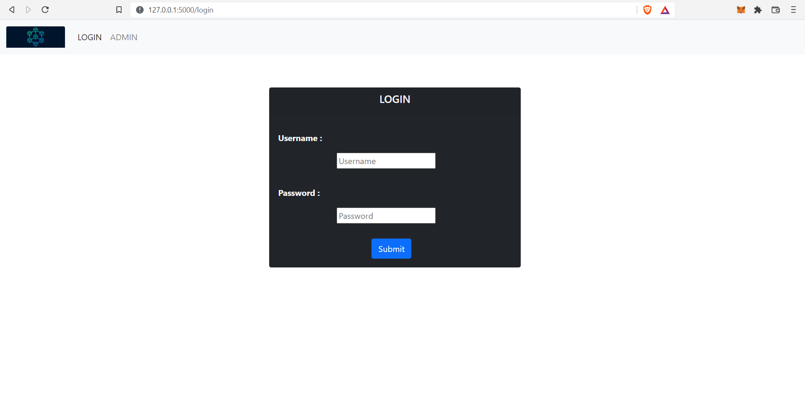
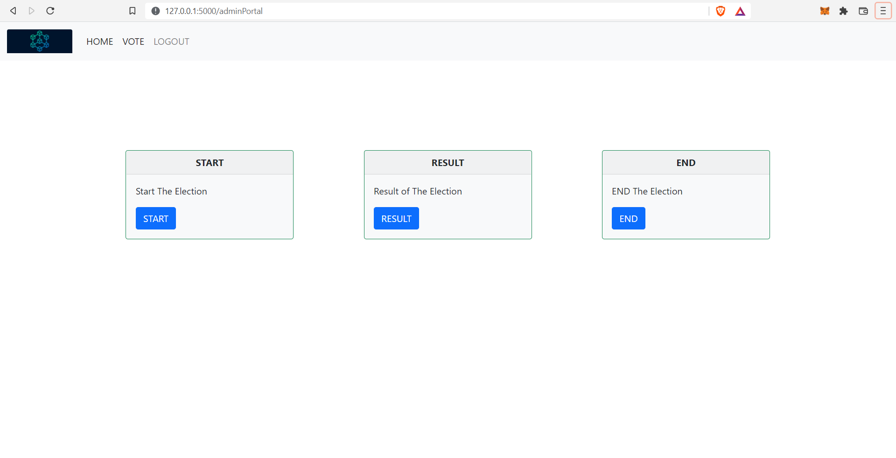
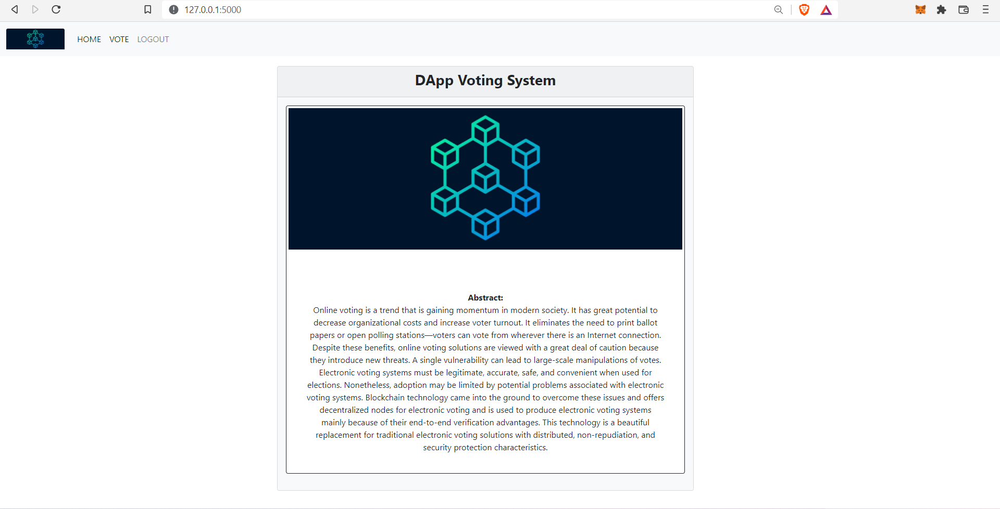
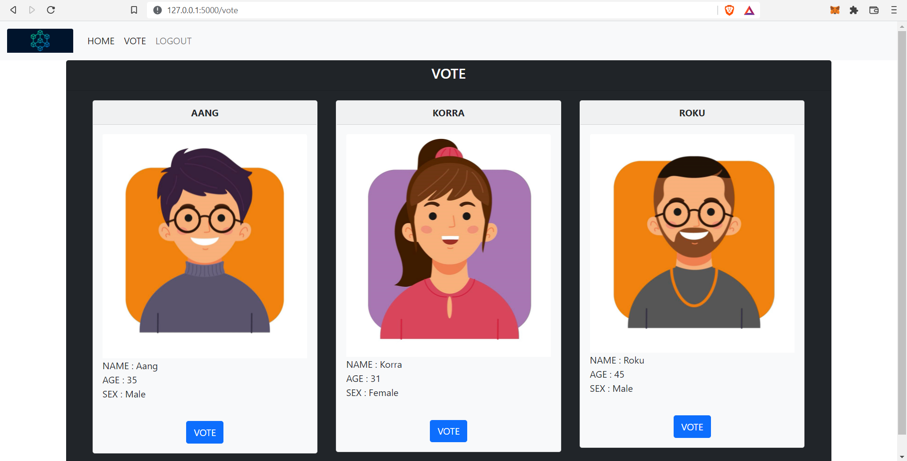
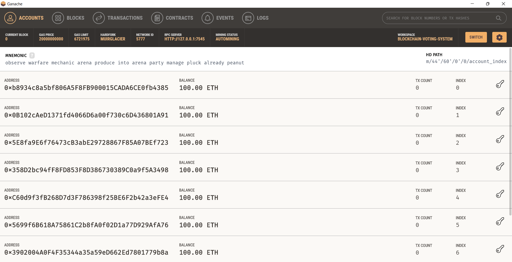
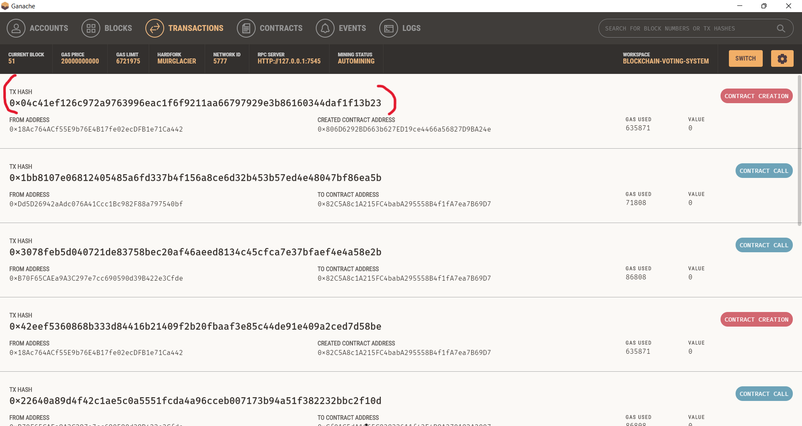
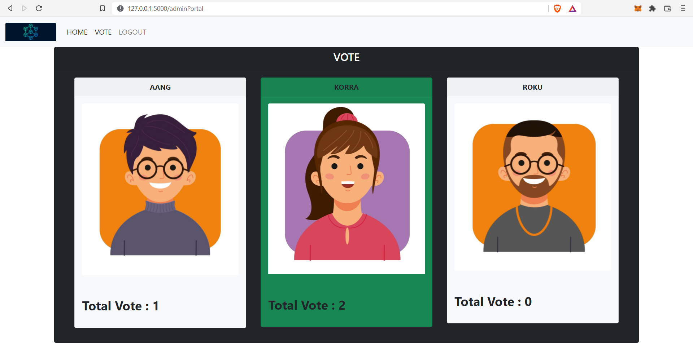

# **_BLOCKCHAIN-VOTING-SYSTEM_**
 
 
 ## **Why should we need it ?**
 
 Online voting is a trend that is gaining momentum in modern society. It has great potential to decrease organizational costs and increase voter turnout. It eliminates the need to print ballot papers or open polling stations—voters can vote from wherever there is an Internet connection. Despite these benefits, online voting solutions are viewed with a great deal of caution because they introduce new threats. A single vulnerability can lead to large-scale manipulations of votes. Electronic voting systems must be legitimate, accurate, safe, and convenient when used for elections. Nonetheless, adoption may be limited by potential problems associated with electronic voting systems. Blockchain technology came into the ground to overcome these issues and offers decentralized nodes for electronic voting and is used to produce electronic voting systems mainly because of other end-to-end verification advantages. This technology is a beautiful replacement for traditional electronic voting solutions with distributed, non-repudiation, and security protection characteristics.

---

## **Login Page**

---

## **Admin Portal**

---

## **Home Page**

---

## **Voting Page**

---

## **Ganache Ethereum Local Network**

---

## **Smart Contract Creation**

---

## **Result**

---

## **_Conclusion_**

Electronic voting has been used in varying forms since the 1970s with fundamental benefits over paper based systems such as increased efficiency and reduced errors. With the extraordinary growth in the use of blockchain technologies, this project
“Blockchain Voting System” has been made to explore the feasibility of using blockchain to aid an effective solution to e-voting.

---

